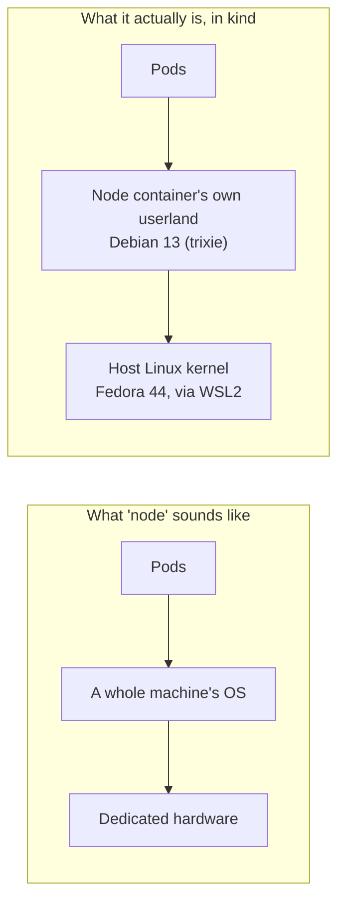
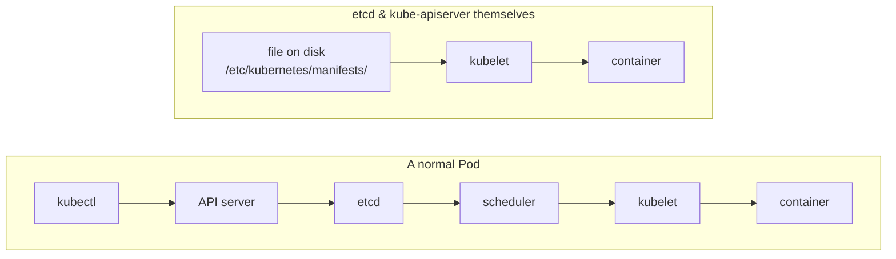
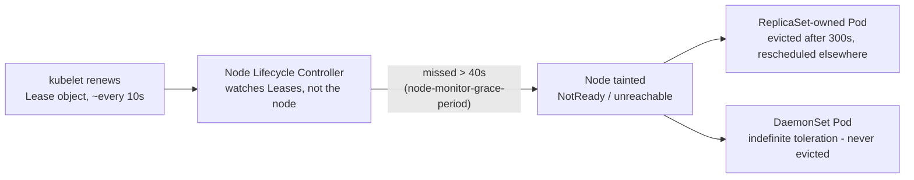
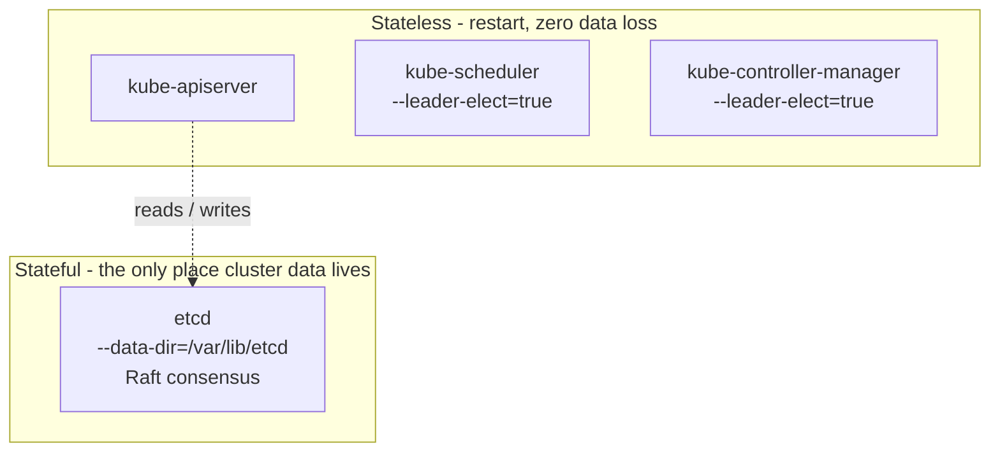
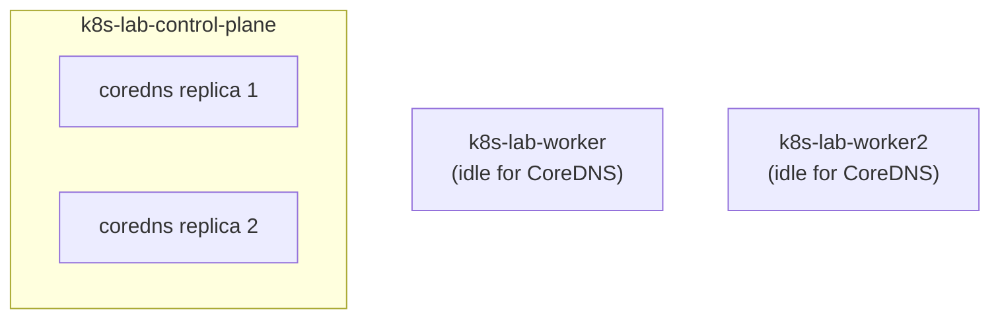

<h1 align="center">kubernetes-labs</h1>

<p align="center">
  Learning Kubernetes properly - from a bare cluster to production-shaped platforms.<br>
  Hands-on labs, a live cluster, and an honest log of everything that broke.
</p>

<p align="center">
  
  
  
  
</p>

---

## What this is

A working repository, not a tutorial copy. Every command here was run against
a real local cluster, and every failure is recorded with its root cause — in
full, one file per day, in [`journal/daily/`](journal/daily/), indexed in
[`journal/learning-journal.md`](journal/learning-journal.md), with a running
quick-reference per module in [`cheatsheets/`](cheatsheets/).

Most Kubernetes notes are a list of `kubectl` commands. That teaches recall,
not reasoning, and it collapses the first time a real cluster behaves
unexpectedly. This repository is built on the opposite premise: the useful
skill is being able to look at a broken cluster and work through

> What is happening? Why is it happening? Which component is responsible?
> How can I prove it? How can I fix it? How do I prevent it?

So this records the **process**, not a polished result. Failed attempts stay
in. Wrong initial understandings stay in, next to the corrected version — see
[`journal/mistakes-and-lessons.md`](journal/mistakes-and-lessons.md). The
mistakes are the most valuable part of it.

**Environment:** `kind` v0.33.0 on Docker Engine 29.7.2, Fedora Linux 44 under
WSL2 — a standard Linux daemon and socket, not Docker Desktop, and no bundled
Kubernetes to inherit. Every cluster here is created explicitly. Full detail:
[`progress/environments.md`](progress/environments.md).

**No CI pipeline yet, deliberately.** docker-labs (the prerequisite phase,
below) lints and builds on every push; the Kubernetes equivalent — manifest
validation, `kubeconform`, policy checks — is scheduled as its own topic at
**Day 93-97 (CI/CD)**. Building it earlier would mean shipping configuration
this repository can't yet explain, which is exactly the trap `kubeadm`
(deferred to Day 78) and the CoreDNS anti-affinity fix (deferred to Day 34/36)
were both written down to avoid.

### The journey, at a glance

```mermaid
flowchart LR
    P1["Foundations<br/>Day 00-05<br/>IN PROGRESS"] --> P2["Workloads<br/>Day 06-13"]
    P2 --> P3["Networking<br/>Day 14-20"]
    P3 --> P4["Config & Storage<br/>Day 21-28"]
    P4 --> P5["Scheduling, Health<br/>& Security<br/>Day 29-45"]
    P5 --> P6["Ingress & Helm<br/>Day 46-52"]
    P6 --> P7["Observability &<br/>Troubleshooting<br/>Day 53-63"]
    P7 --> P8["Internals &<br/>Extending<br/>Day 64-76"]
    P8 --> P9["Autoscaling,<br/>Production, Cloud<br/>Day 77-92"]
    P9 --> P10["CI/CD, GitOps,<br/>Advanced<br/>Day 93-108"]
    P10 --> P11["CKA / CKAD / CKS<br/>Day 109-126"]
    P11 --> P12["Capstone<br/>Day 127-130"]
```



Full detail behind every box: [`progress/daily-plan.md`](progress/daily-plan.md)
— 131 days, 10 projects, 3 certifications.

---

## Progress

**Day 03 of 130 — Module 01, Kubernetes Fundamentals — IN PROGRESS.** A 3-node
`kind` cluster is running Kubernetes v1.37.0, verified healthy.

| Day | Topic | Status | Evidence |
|:--:|---|---|---|
| 00 | Setup, and what Kubernetes actually is | **Complete** | [journal](journal/daily/day-00-setup-and-what-is-kubernetes.md) |
| 01 | Cluster setup with `kind`, LAB 01 + break/fix challenge | **Complete** | [journal](journal/daily/day-01-cluster-setup.md) |
| 02 | Control plane vs worker node, static Pod manifests, CoreDNS finding | **Complete** | [journal](journal/daily/day-02-control-plane-and-nodes.md) &middot; [cheatsheet](cheatsheets/module-01-fundamentals.md) |
| 03 | Architecture and the request flow | Not started | [lab (queued)](progress/next-steps.md) |
| 04-05 | kubectl core verbs; namespaces, labels, selectors | Not started | — |

Full day-by-day plan (all 131 days): [`progress/daily-plan.md`](progress/daily-plan.md)
Where work stopped: [`progress/current-progress.md`](progress/current-progress.md)
What is next: [`progress/next-steps.md`](progress/next-steps.md)

**Nothing is marked COMPLETED until theory was understood, the lab was run, and
verification output was actually seen** — see the Status legend near the
bottom of this file.

### Next topic

Day 03 — Architecture and the request flow: trace `kubectl apply` through all
14 steps against the live cluster, confirming each step with evidence rather
than theory alone.

<details>
<summary><strong>Full 30-module progress table</strong></summary>

| Module | Topic | Status |
|:--:|---|---|
| 01 | Kubernetes Fundamentals | IN PROGRESS |
| 02 | Architecture | NOT STARTED |
| 03 | kubectl | NOT STARTED |
| 04 | Pods | NOT STARTED |
| 05 | ReplicaSets | NOT STARTED |
| 06 | Deployments | NOT STARTED |
| 07 | Services | NOT STARTED |
| 08 | Networking | NOT STARTED |
| 09 | ConfigMaps & Secrets | NOT STARTED |
| 10 | Storage | NOT STARTED |
| 11 | Scheduling | NOT STARTED |
| 12 | Resources | NOT STARTED |
| 13 | Health Checks | NOT STARTED |
| 14 | Security / RBAC | NOT STARTED |
| 15 | Ingress | NOT STARTED |
| 16 | Helm | NOT STARTED |
| 17 | Monitoring | NOT STARTED |
| 18 | Troubleshooting | NOT STARTED |
| 19 | Kubernetes Internals | NOT STARTED |
| 20 | CRD / Operators | NOT STARTED |
| 21 | Autoscaling | NOT STARTED |
| 22 | Production Kubernetes | NOT STARTED |
| 23 | AWS EKS | NOT STARTED |
| 24 | Azure AKS | NOT STARTED |
| 25 | CI/CD | NOT STARTED |
| 26 | GitOps | NOT STARTED |
| 27 | Advanced Kubernetes | NOT STARTED |
| 28 | CKA | NOT STARTED |
| 29 | CKAD | NOT STARTED |
| 30 | CKS | NOT STARTED |

</details>

---

## Mental model

Diagrams for the things that were easiest to get wrong until they were seen on
a live cluster, not just read about. Every caption cites the day and the
actual command that produced the evidence — nothing here is diagrammed ahead
of being verified.

**A Kubernetes node, in `kind`, is a container — not a separate machine.**



Day 01, verified directly: `kubectl get nodes -o wide` reports `Debian GNU/Linux
13` on every node's `OS-IMAGE` column, while the host is Fedora — the exact
shared-kernel model already proven for plain containers in the prerequisite
Docker phase.

**A static Pod bootstraps the control plane before the control plane exists.**



Day 02, confirmed with `docker exec -it k8s-lab-control-plane ls -l
/etc/kubernetes/manifests/`: all four files present
(`etcd.yaml`, `kube-apiserver.yaml`, `kube-controller-manager.yaml`,
`kube-scheduler.yaml`), root-only permissions, identically timestamped at
cluster creation — written before any API server existed to create them
another way.

**A taint doesn't decide a Pod's fate — its owning controller does.**



Day 01-02, measured directly: `docker stop` on a worker to `NotReady` took 44
seconds against a ~40s predicted grace period. The node's two DaemonSet Pods
(`kube-proxy`, `kindnet`) stayed listed the entire time, `0` restarts — a
DaemonSet's "one per node" contract has no "elsewhere" to reschedule to.

**Stateless vs stateful control-plane components — a concrete test, not a guess.**



Day 02: does the manifest have `--data-dir` plus a real data volume mount, or
only a kubeconfig/certificate volume? `etcd` has the former; the other three
have only the latter. Got `kube-scheduler` wrong on the first attempt before
applying this test properly — recorded as Mistake 002, not edited away.

**Two replicas is not automatically redundancy — verified on this cluster, not assumed.**



Day 02: `kubectl get pods -n kube-system -o wide | grep coredns` showed both
replicas on the *same* node, corroborated by identical, simultaneous restart
counts on both Pods. Root cause: CoreDNS's anti-affinity is a soft preference,
and it is created before the workers finish joining the cluster. Fix
deliberately deferred to Day 34 (`required` anti-affinity) / Day 36 (topology
spread) — recorded as a finding, not silently patched.

---

## What I can explain, not just run

Updated as I go — each line is something demonstrated in this repository, with
a day and a command behind it. Nothing here is written ahead of being verified.

- **Why a Kubernetes node isn't a separate machine.** `kubectl get nodes -o
  wide` reports Debian on every node while the host is Fedora — the node is a
  Docker container sharing the host's WSL2 kernel, the same shared-kernel model
  already proven for plain containers.
- **Why `kubectl apply` returning "created" doesn't mean anything is
  running.** Traced the 14-step path from `kubectl` to a `Running` Pod;
  "created" is only step 6 — before the ReplicaSet, the scheduler, or the
  kubelet have done anything at all.
- **What a Pod's name actually tells you**, read straight off `kubectl get
  pods -n kube-system` with no `describe` needed: `<name>-<node-name>` is a
  static Pod, `<name>-<5 chars>` is a DaemonSet, `<name>-<10 chars>-<5 chars>`
  is a Deployment (ReplicaSet hash, then Pod hash).
- **How the control plane bootstraps itself before it exists.** Confirmed with
  `docker exec` into the control-plane node: `etcd.yaml`, `kube-apiserver.yaml`,
  `kube-controller-manager.yaml`, and `kube-scheduler.yaml` sit on disk at
  `/etc/kubernetes/manifests/`, root-only (600), identically timestamped at
  cluster creation.
- **A concrete, checkable test for "is this component stateful"** — does its
  manifest have `--data-dir` plus a real data volume? `etcd` does; `kube-
  apiserver`, `kube-scheduler`, and `kube-controller-manager` don't, only a
  kubeconfig/cert volume. Got this wrong once on `kube-scheduler` before
  applying the test mechanically — see Mistake 002.
- **Two different high-availability mechanisms live in one control plane.**
  `etcd` uses Raft consensus — every write needs a majority vote among members
  (`--initial-cluster` lists all of them; one entry here means a "cluster of
  one"). `kube-scheduler` and `kube-controller-manager` use
  `--leader-elect=true` instead — one active leader, the rest idle standbys.
  Different because one component is stateful and the others aren't.
- **How the control plane learns a worker node has failed, without ever
  polling it.** The kubelet renews a small `Lease` object roughly every 10s;
  the Node Lifecycle Controller watches leases, not the node. Measured
  directly: 44 seconds from `docker stop` to the node's `Ready` condition
  flipping to `Unknown`, against a ~40s predicted grace period.
- **Why a taint alone doesn't decide a Pod's fate — its owning controller
  does.** Stopped a worker running two DaemonSet Pods (`kube-proxy`,
  `kindnet`): both stayed listed the entire time, `0` restarts, because a
  DaemonSet gets an automatic, indefinite toleration for the `unreachable`
  taint. A ReplicaSet-owned Pod under the identical taint is evicted after
  300s and rescheduled elsewhere.
- **Two replicas is not automatically redundancy.** Found both CoreDNS Pods
  scheduled on the *same* node, confirmed by the `NODE` column and
  corroborated by identical, simultaneous restart counts on both — a real,
  verified single point of failure, not a hypothetical one.
- **Why `kubectl describe`'s Events section beats a live watch.** A
  `(x2 over 26m)` event count proved an earlier, seemingly-aborted node-failure
  experiment had actually triggered a real transition that nobody saw live,
  because the watch session had already been closed.

---

## How to use this repository

If you are learning Kubernetes yourself, this is the intended route:

| Step | Where |
|---|---|
| 1. See the whole plan | [`progress/daily-plan.md`](progress/daily-plan.md) — every day, Day 00 to Day 130 |
| 2. Understand the ordering | [`progress/roadmap.md`](progress/roadmap.md) |
| 3. Start the theory | [`fundamentals/`](fundamentals/) |
| 4. Do the lab before reading ahead | `*/labs/` |
| 5. Read the failures early | [`journal/mistakes-and-lessons.md`](journal/mistakes-and-lessons.md) |
| 6. Follow the narrative | [`journal/daily/`](journal/daily/) |
| 7. Look something up fast | [`cheatsheets/`](cheatsheets/) |
| 8. Copy working manifests | [`examples/`](examples/) |
| 9. Diagnose something broken | [`troubleshooting/`](troubleshooting/) |

Every lab is written so it can be run independently. Every command is documented
with what it does and why it was used, not just its syntax.

---

## Quick start

```bash
git clone https://github.com/sagarsaitwal/kubernetes-labs.git /mnt/d/Kubernetes
cd /mnt/d/Kubernetes
bash scripts/utilities/setup-machine.sh

cd fundamentals/labs
kind create cluster --name k8s-lab --config kind-cluster-config.yaml

kubectl get nodes -o wide
kubectl get pods -n kube-system
```

The clone path is not optional — see Working across devices, below. Every lab
in this repository assumes the repository sits at `/mnt/d/Kubernetes`.

---

## Prerequisites

Assumed known before starting — all covered in the preceding Docker phase:

- Basic Linux: filesystem, processes, permissions, systemd, package management
- Basic networking: IP, ports, DNS, TCP
- Docker: images, layers, containers, volumes, networks, Compose
- YAML syntax
- Git

The Docker phase this builds on is summarised in
[`Reference/DockerSummary.md`](Reference/DockerSummary.md) — a 14-day hands-on
project, source at https://github.com/sagarsaitwal/docker-labs

---

## Lab environment

Local-first, free, and reproducible. No cloud spend for the fundamentals.

| Item | Value |
|---|---|
| Host OS | Windows 11 Pro |
| Linux | WSL2, FedoraLinux-44 |
| Kernel | 6.18.33.2-microsoft-standard-WSL2 |
| Architecture | x86_64 |
| cgroup | cgroup2fs (v2 unified) |
| Container runtime | Docker Engine 29.7.2, in-distro — **not** Docker Desktop |
| CPU | 8 |
| Memory | 7.6 GiB |
| Cluster tool | `kind` v0.33.0 (Kubernetes v1.37.0) |

Two details of this setup matter more than they look:

1. **Docker Engine, not Docker Desktop.** There is no bundled single-node
   Kubernetes to inherit. Every cluster here is created explicitly, which means
   every knob is visible rather than preconfigured.
2. **cgroup v2 unified.** kind runs each Kubernetes node as a Docker container,
   and the kubelet inside it needs a writable cgroup hierarchy to enforce Pod
   resource limits. Older WSL2 shipped a hybrid cgroup v1 layout that broke this.

`kubeadm` — building a cluster by hand — is deliberately deferred to Module 22,
once there is enough context for it to teach something.

Per-machine details (multiple machines, tracked side by side):
[`SystemInfo.md`](SystemInfo.md) &middot; [`progress/environments.md`](progress/environments.md)

---

## Working across devices

This repository is used from more than one machine, so it is built to be the
portable state rather than relying on any single device.

### One folder, same path on every machine

| | Path |
|---|---|
| Windows | `D:\Kubernetes` |
| WSL / Linux | `/mnt/d/Kubernetes` |

Edited from Windows, run from WSL, synchronised through GitHub. There is no
separate lab directory and nothing is copied by hand — which means every command
in this repository can be copied verbatim to either machine.

### Setting up a new machine

```bash
git clone https://github.com/sagarsaitwal/kubernetes-labs.git /mnt/d/Kubernetes
cd /mnt/d/Kubernetes
bash scripts/utilities/setup-machine.sh
```

The clone path is not optional. The script then verifies prerequisites (cgroup
v2, Docker reachability, memory), installs `kubectl` and `kind` with checksum
verification if they are missing, and prints this machine's environment facts.

### Resuming on the other machine

```bash
cd /mnt/d/Kubernetes && git pull
cat progress/current-progress.md                      # where work stopped
bash scripts/utilities/check-dependencies.sh          # what this machine lacks
```

The check reads the current day and reports **only** what that day needs —
host tools, cluster state, and in-cluster components — so nothing is installed
before it can be explained. Full reference:
[`progress/dependencies.md`](progress/dependencies.md)

### What does and does not travel

| Travels via git | Does **not** travel |
|---|---|
| All repository content | The cluster — `kind` nodes are local Docker containers |
| Learning progress and journals | Objects running in it — they live in that cluster's etcd |
| Manifests and configuration | kubeconfig — points at a local port, and is `.gitignore`d |
| | Pulled container images — local Docker cache |

**Cluster state is disposable; repository state is not.** Anything worth keeping
must be a committed manifest, not a live object — which is the same discipline
GitOps formalises later in the course.

---

## Repository structure

```text
kubernetes-labs/
|
|-- README.md                 This file
|-- CLAUDE.md                 Working agreement; read first on any machine
|-- LICENSE                   MIT
|-- CONTRIBUTING.md           Conventions used throughout
|-- SystemInfo.md             Per-machine tool versions, checked at every session start
|
|-- progress/                 Portable learning state (read this first)
|   |-- current-progress.md   Source of truth for where learning stopped
|   |-- daily-plan.md         Full Day 00-130 plan, every day and lab
|   |-- environments.md       Per-machine facts and the path convention
|   |-- dependencies.md       What must exist on a device, by day
|   |-- roadmap.md            Module ordering and rationale
|   |-- completed-topics.md   Only verified completions
|   |-- next-steps.md         Queue and unresolved decisions
|
|-- journal/
|   |-- learning-journal.md          Chronological index, one row per day
|   |-- daily/                       Full detail, one file per learning day
|   |   |-- day-NN-topic.md
|   |-- TEMPLATE-daily-entry.md      Fixed section layout for new entries
|   |-- mistakes-and-lessons.md      Accumulated failures, searchable by symptom
|
|-- cheatsheets/              Running quick-reference per module (commands, flags, concepts)
|-- fundamentals/             Module 01-03: architecture, kubectl, namespaces, labels, API
|-- workloads/                Pods, ReplicaSets, Deployments, StatefulSets, DaemonSets, Jobs, CronJobs
|-- networking/               Pod networking, Services, DNS, Ingress, NetworkPolicy, CNI
|-- storage/                  Volumes, PV, PVC, StorageClasses, CSI
|-- configuration/            ConfigMaps, Secrets
|-- scheduling/               nodeSelector, affinity, taints/tolerations, topology spread
|-- security/                 RBAC, ServiceAccounts, SecurityContext, Pod Security
|-- resources/                Requests/limits, ResourceQuota, LimitRange, autoscaling
|-- health/                   Liveness, readiness, startup probes
|-- helm/                     Helm fundamentals, charts, projects
|-- observability/            Metrics, Prometheus, Grafana, logging, alerting
|-- troubleshooting/          Symptom-indexed diagnostic knowledge base
|-- internals/                API server, etcd, scheduler, controllers, kubelet, CRI/CNI/CSI
|-- aws/eks/                  Amazon EKS
|-- azure/aks/                Azure AKS
|-- cicd/                     GitLab, Jenkins, container registry
|-- gitops/argocd/            Argo CD
|-- examples/                 Small, focused, reusable manifests
|-- projects/                 Progressively harder end-to-end projects
|-- scripts/
|   |-- utilities/setup-machine.sh       One-command setup for a new machine
|   |-- utilities/check-dependencies.sh  What this machine is missing today
|
|-- Reference/                Source material and prerequisite summary
```

---

## Projects

Built after the modules that make them possible. Each gets its own README,
manifests, architecture diagram, and troubleshooting notes.

| # | Project | Contents | Status |
|:--:|---|---|---|
| 01 | First Kubernetes application | Nginx + Deployment + Service | NOT STARTED |
| 02 | Python web application | Deployment + Service + ConfigMap | NOT STARTED |
| 03 | Application + database | App + PostgreSQL + PVC + Secret | NOT STARTED |
| 04 | Production-style web app | Ingress + TLS + Deployment + Service + ConfigMap + Secret | NOT STARTED |
| 05 | Monitoring | Prometheus + Grafana + metrics | NOT STARTED |
| 06 | Logging | Centralised log collection | NOT STARTED |
| 07 | CI/CD | Git to CI to image to registry to Kubernetes | NOT STARTED |
| 08 | GitOps | Git to Argo CD to Kubernetes | NOT STARTED |
| 09 | AWS EKS | VPC + EKS + node groups + ALB + IAM + storage | NOT STARTED |
| 10 | Production platform | HA, security, monitoring, logging, autoscaling, Ingress, CI/CD, GitOps | NOT STARTED |

---

## Troubleshooting knowledge

A symptom-indexed reference built up as failures actually happen — not copied
from documentation. Each entry follows the same shape:

```text
SYMPTOM -> CHECK -> COMMAND -> OUTPUT -> INTERPRETATION
   -> ROOT CAUSE -> FIX -> VERIFICATION -> PREVENTION
```

Planned coverage: `Pending`, `CrashLoopBackOff`, `ImagePullBackOff`,
`ErrImagePull`, `CreateContainerConfigError`, `OOMKilled`, `ContainerCreating`,
stuck `Terminating`, `NodeNotReady`, Service with no endpoints, DNS failure,
Ingress 404, Ingress 502, NetworkPolicy blocking traffic, PVC `Pending`, mount
failures, RBAC denied, probe failures, stuck rollouts, registry problems.

Three entries exist so far, born from real Day 01-02 experiments rather than
written ahead of time — see the Troubleshooting Knowledge sections in
[`journal/daily/day-02-control-plane-and-nodes.md`](journal/daily/day-02-control-plane-and-nodes.md).
Not yet promoted to the dedicated `troubleshooting/` folder — that happens once
there are enough entries per category to organise, rather than one file per
finding.

---

## Daily learning journal

One file per learning day in [`journal/daily/`](journal/daily/), named
`day-NN-topic.md` so the list sorts in learning order **and** reads as a
curriculum. The calendar date is recorded inside each file and in the index
table below.

Each entry records the objective, theory, every command with an explanation of
what it does and why, YAML, the lab performed, the environment, expected vs
actual result, what broke, the error message, the investigation, the root cause,
the fix, the verification, the lesson, and what comes next.

| Date | Day | Topic | Status |
|---|---|---|---|
| 2026-09-16 | [00](journal/daily/day-00-setup-and-what-is-kubernetes.md) | Setup and what is Kubernetes | COMPLETED |
| 2026-09-16 | [01](journal/daily/day-01-cluster-setup.md) | Cluster setup (LAB 01) | COMPLETED |
| 2026-09-16 / 09-18 | [02](journal/daily/day-02-control-plane-and-nodes.md) | Control plane vs worker node | COMPLETED |

---

## Status legend

| Marker | Meaning |
|---|---|
| NOT STARTED | Not begun |
| IN PROGRESS | Partially completed |
| COMPLETED | Theory + lab + verification + exercise all done |
| NEEDS REVISION | Completed, but knowledge gaps were demonstrated |
| BLOCKED | Cannot proceed until something is resolved |

---

## A note on secrets

This repository is public. No credentials, keys, tokens, certificates, account
IDs, or private infrastructure details are committed. Placeholders are used
throughout: `<YOUR_AWS_ACCOUNT_ID>`, `<YOUR_DOMAIN>`, `<YOUR_REGION>`,
`<YOUR_REGISTRY>`, `<YOUR_SECRET>`.

Note also that a Kubernetes Secret is only base64-encoded, not encrypted. A
Secret manifest with real values is as sensitive as a plaintext password file
and is never committed here.

---

## References

- [Kubernetes documentation](https://kubernetes.io/docs/)
- [kind documentation](https://kind.sigs.k8s.io/)
- [kubectl reference](https://kubernetes.io/docs/reference/kubectl/)

## License

MIT — see [LICENSE](LICENSE).
